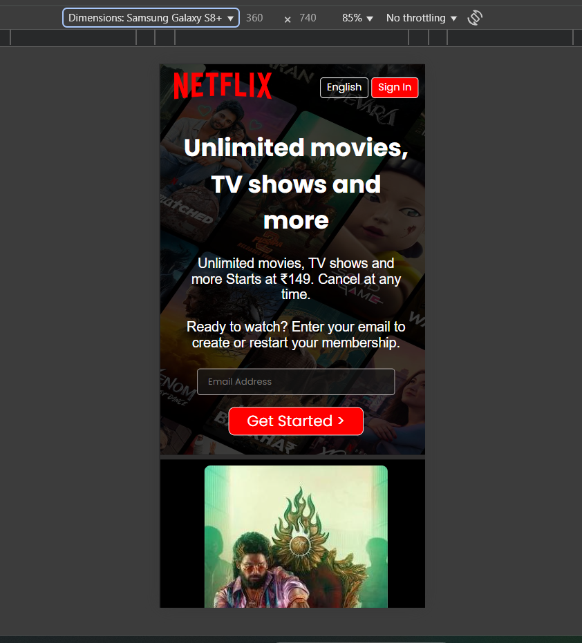
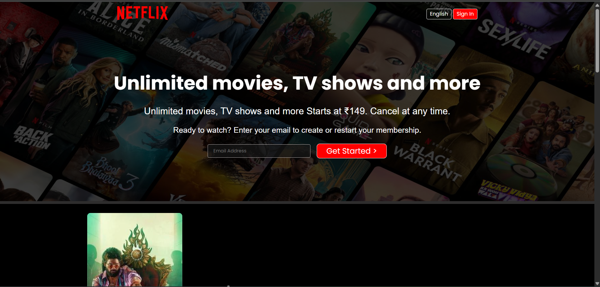

# 🎬 FilmFlix – Netflix Clone

FilmFlix is a simple yet responsive **Netflix landing page clone** built using **HTML** and **CSS**.  
It closely mimics the Netflix homepage UI and adapts perfectly to desktop and mobile screens.  

👉 **Live Demo:** [FilmFlix on Vercel](https://filmflix-demo-nn1z-git-main-harshitha-kuchanas-projects.vercel.app/)

---

## 🚀 Features

- 🎥 Netflix-inspired landing page  
- 📱 Fully responsive layout (desktop, tablet, and mobile)  
- 🌙 Dark theme with bold visuals  
- 🖼️ Clean and simple design using only HTML & CSS  

---

## 🛠️ Tech Stack

- **HTML5**  
- **CSS3** (Flexbox & Grid for responsiveness)  
- **Deployment:** [Vercel] 

---

## 📸 Screenshots

### 📱 Mobile View
*(Screenshot from mobile screen size)*


### 🖥️ Desktop View
*(Screenshot from desktop screen size)*


---

## 📂 Getting Started

You can run this project locally in just a few steps:

1. **Clone the repository**
   ```bash
   git clone https://github.com/<your-username>/<repo-name>.git


